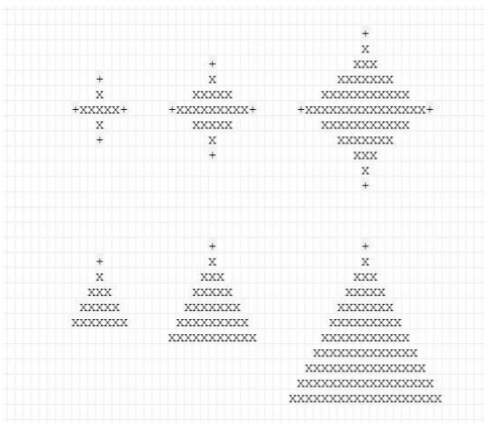

# ShapeGenerator

* Generate ASCII Shape.

## About

* Example of Generated Shape 


## Installing

* Via composer
* From app directory
```
$ composer install
```

## Run application
* From app directory 
```
   php Index.php
```
* if you want to change sizes change it from Index.php file

## Running the tests

`$ composer test`

# Wrong in Example
* Large star shape does not follow the other two patterns.
- Reason: 
```
   It is not give us a stright line in the second line and third line
   also in the last line and the previous one.
   in the tow star shap it is always add to more 'X' from right and left
   that end it up with star with stright lines   
```

# unclear
* dealing with even height in star shape (how to define the Middle line).
